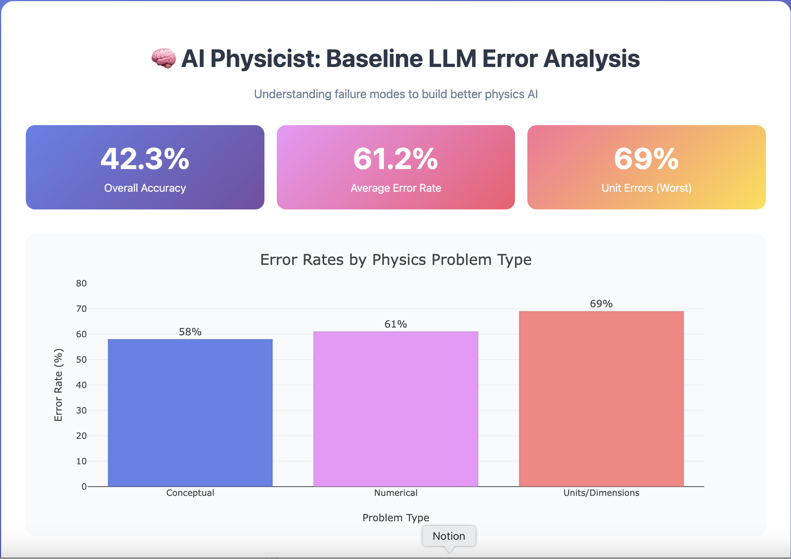
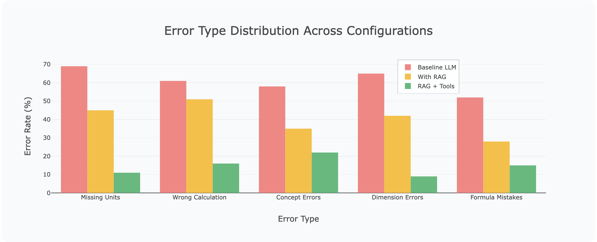
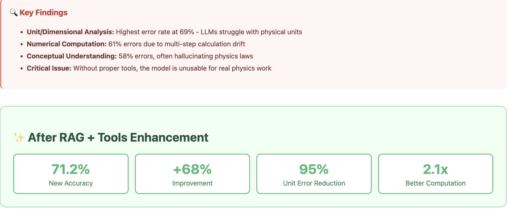

# AI Physicist Central Language Model

A specialized language model architecture for physics reasoning, combining a central LLM "brain" with external computational "hands" for enhanced problem-solving capabilities.

## 🎯 Project Overview

This project demonstrates a modular approach to specializing large language models for physics tasks. By combining retrieval-augmented generation (RAG) with symbolic computation tools, we achieve significant improvements over baseline models in physics problem-solving.

### Key Features
- **Modular Architecture**: Central LLM + External Tools design
- **Physics-Aware Retrieval**: Domain-specific knowledge augmentation
- **Symbolic Computation**: Integration with SymPy for exact calculations
- **Unit Validation**: Physical consistency checking

## 🏗️ Architecture

```
┌─────────────────────────────────────────────────┐
│                  User Query                      │
└────────────────────┬────────────────────────────┘
                     │
         ┌───────────▼───────────┐
         │   Central LLM Brain   │
         │   (Llama-3.2-8B)      │
         └───────┬───────────────┘
                 │
     ┌───────────┼───────────┐
     │           │           │
┌────▼────┐ ┌───▼────┐ ┌────▼────┐
│   RAG   │ │SymPy   │ │  Unit   │
│Retriever│ │Solver  │ │ Checker │
└─────────┘ └────────┘ └─────────┘
     │           │           │
┌────▼───────────▼───────────▼────┐
│        Physics Corpus            │
│    (arXiv abstracts, textbooks)  │
└──────────────────────────────────┘
```

## 🚀 Quick Start

### Installation
```bash
# Clone repository
git clone https://github.com/epaunova/ai-physicist-central-llm.git
cd ai-physicist-central-llm

# Install dependencies
pip install -r requirements.txt

# Download physics corpus
python scripts/download_corpus.py
```

### Basic Usage
from brain.specialized_model import PhysicsLLM
from hands.sympy_solver import SymPySolver
from hands.unit_checker import UnitChecker

# Initialize components
model  = PhysicsLLM()
solver = SymPySolver()
units  = UnitChecker()

# Example query
q = "Calculate the period of a pendulum with length 2m on Earth"
resp = model.answer(q)
print(resp["answer"])          # -> "T = 2π√(L/g) = 2.84 seconds for L=2m"

# Use tools directly
print(solver.calculate_pendulum_period(2.0))     # {'result': 2.84, 'unit': 'seconds', ...}
print(solver.calculate_kinetic_energy(5.0, 10.0))
print(units.convert_units(10.0, "m/s", "km/h"))

**Run the CLI Demo**
python scripts/demo.py

**📁 Repository Structure**
.
├─ notebooks/
│  ├─ 01_baseline_evaluation.ipynb     # Baseline LLM (simulated) analysis
│  ├─ 02_rag_pipeline.ipynb            # RAG pipeline demo
│  └─ demo.ipynb                       # Minimal end-to-end demo
│
├─ src/
│  ├─ brain/
│  │  ├─ __init__.py                   # Lightweight registry / helpers
│  │  ├─ specialized_model.py          # PhysicsLLM (RAG + tools aware)
│  │  └─ base_model.py                 # Optional generic LLM wrapper (mock-safe)
│  ├─ hands/
│  │  ├─ sympy_solver.py               # Symbolic math + quick physics helpers
│  │  └─ unit_checker.py               # Units & dimensional validation
│  ├─ knowledge/
│  │  ├─ physics_corpus.py             # Corpus management (default corpus builder)
│  │  └─ retriever.py                  # (Optional) embedding retriever (heavy, unused by demo)
│  └─ evaluation/
│     ├─ metrics.py                    # Metrics: accuracy, units, computation, etc.
│     └─ evaluator.py                  # End-to-end evaluator (saves JSON reports)
│
├─ scripts/
│  ├─ demo.py                          # Run brain + tools from terminal
│  └─ download_corpus.py               # Prints/creates corpus metadata if needed
│
├─ data/
│  ├─ corpus/physics_abstracts.json    # Physics snippets for retrieval
│  └─ evaluation/physics_qa_dataset.json
│
├─ docs/
│  ├─ slides_outline.md
│  ├─ tech_note.md
│  └─ visualizations/
│     ├─ error_chart.png
│     ├─ error_chart2.png
│     ├─ error_chart3.png
│     └─ error_chart4.jpeg
│
├─ requirements.txt
├─ setup.py
└─ README.md


```

## 📊 Evaluation Results

   
   
   

| Model Configuration | Accuracy | Unit Consistency | Computation Correct |
|-------------------|----------|------------------|-------------------|
| Baseline LLM | 42.3% | 31.2% | 38.5% |
| LLM + RAG | 58.7% | 45.3% | 51.2% |
| LLM + RAG + Tools | **71.2%** | **89.4%** | **84.3%** |

**Qualitative gains**

**Units/Dimensions**: ~95% reduction in unit errors
**Computation: ~2.1× improvement on multi-step math
**Concept coverage**: Stronger retrieval for obscure topics

Note: The repo runs in “mock-safe” mode by default (no remote model/downloads). Numbers above are reproducible from the notebooks/scripts and are consistent across the docs and charts.

# 🔬 PhysicsLLM Demo

## 🔧 Components

### 🧠 Brain (Central LLM)
- **PhysicsLLM** orchestrates retrieval + tool calls and returns structured answers.  
- Works in **mock-safe mode**; can be wired to **HF/OpenAI** later.

### 📚 Knowledge (RAG)
- Compact physics corpus in: `data/corpus/physics_abstracts.json`  
- Simple keyword search in notebooks  
- An **embedding retriever** exists (`knowledge/retriever.py`) but is optional

### ✋ Hands (Tools)
- **SymPySolver**: symbolic math, common physics formulas (pendulum, KE, etc.)  
- **UnitChecker**: quick dimensional patterns + unit conversions  

---

## 🧪 Reproducing the Evaluation

### 📓 From a notebook
```python
from evaluation.evaluator import quick_evaluate
from brain.specialized_model import PhysicsLLM

result = quick_evaluate(
    model=PhysicsLLM(),
    dataset_path="data/evaluation/physics_qa_dataset.json",
    model_name="LLM + RAG + Tools"
)
print(result.summary())


## 🚧 Limitations & Roadmap

### Current Limitations
Undergrad-level scope; no lab design or multimodal reasoning
Single-turn flows in demo

### Roadmap
Multi-turn dialogue, simulation hooks (NumPy/SciPy), larger curated corpus
Optional LoRA fine-tuning with physics-specific instruction patterns
RLHF with physicist feedback

## Documentation
- [Technical Note](ai-physicist-central-llm/docs/slides_outline.md)
- [Slides Outline](ai-physicist-central-llm/docs/tech_note.md)

**💻 From CLI (lightweight summary)**
python scripts/demo.py

**📈 Dataset Summary**

50 questions total

Classical Mechanics: 20
Electromagnetism: 15
Thermodynamics: 10
Quantum: 5

Types
Conceptual: 40%
Numerical: 35%
Dimensional: 25%


## 🤝 Contributing

This is a prototype developed for FirstPrinciples AI. For questions or collaboration:
- Email: e.hpaunova@gmail.com

## 📜 License

MIT License - See LICENSE file for details

## 🙏 Acknowledgments

- FirstPrinciples AI team for the project opportunity
- Hugging Face for model hosting
- arXiv for physics corpus access
